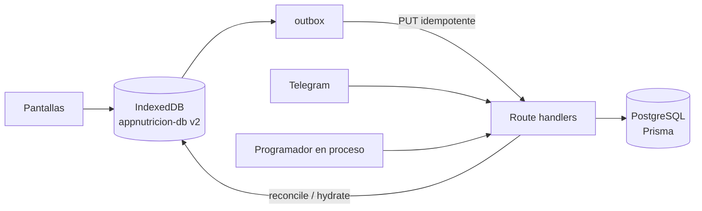
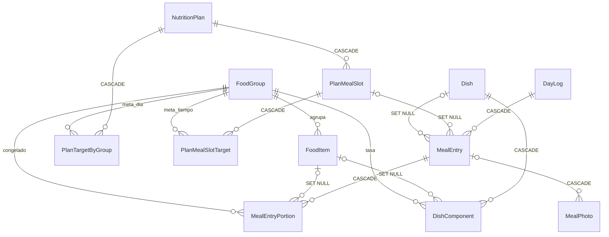

# Arquitectura de la base de datos

Mapa de **cómo está armada la base hoy** (2026-10-06). Si este archivo y el
código discrepan, manda el código: `prisma/schema.prisma` para Postgres y
`lib/db/` para el teléfono.

| Archivo | Qué es |
|---|---|
| `APP-NUTRICION-SPEC_v3.md` | Contrato de diseño. No se edita. Las referencias `§x.y` apuntan ahí. |
| `ESTADO.md` | Qué hay sembrado, qué fases están hechas y por qué el código se apartó del spec. |
| `ARQUITECTURA.md` | Mapa de la app (capas, flujos, despliegue). El §5 resume la base y apunta aquí. |
| `ARQUITECTURA-BD.md` | Este archivo: Postgres, el espejo en IndexedDB y las reglas que no son constraints. |

Postgres es la fuente. IndexedDB es la copia con la que registra el teléfono
sin red. Los dos no son el mismo esquema: el teléfono guarda un subconjunto y
añade la cola de sincronización.

---

## 1. Dos almacenes

| | Postgres | IndexedDB |
|---|---|---|
| Dónde | Servicio Database de Dokploy. Una sola base, un solo atleta. | `appnutricion-db`, versión 2, en el teléfono (`lib/db/indexeddb.ts`). |
| Qué guarda | Catálogo, plan, registros, fotos, peso histórico, Telegram, trabajos. | Espejo del catálogo y del plan, días y comidas, outbox, revisión fusionada. |
| Quién escribe catálogo y plan | El seed y `applyDataFixups` al arrancar. No hay ruta HTTP que los cree. | La app los reescribe al hidratar. Los platillos que el atleta guarda nacen aquí y suben con `PUT`. |
| Quién escribe un registro | `PUT /api/days/[id]` y `PUT /api/days/[id]/meals/[mealId]`, más Telegram en el servidor. | `registerMeal` primero. La red llega después. |
| Fotos | `MealPhoto.datos` en `bytea`. | No. La foto se sube directo al servidor. |

No hay Postgres ni Docker en local. El esquema se cambia con
`prisma migrate diff` (receta en `ESTADO.md`) y se comprueba contra la URL en
vivo.

---

## 2. Postgres: diagrama

Nombres de tabla = nombres de modelo. Prisma no usa `@@map`.

Sin llave foránea, a propósito o porque no hace falta:

| Tabla | Por qué está suelta |
|---|---|
| `User` | Una fila. Nada le apunta. |
| `MealEntryAudit` | El snapshot tiene que sobrevivir si algún día se borra la comida de verdad. `mealEntryId` es texto, no FK. |
| `ScheduledJob` | Cola de trabajos. La clave es `tipo:fecha`. |
| `TelegramUpdate` | Deduplicación del webhook. `mealEntryId` es texto, no FK. |
| `TelegramSession` | Estado de una conversación. La clave es el `chatId`. |
| `WeightEntry` | Histórico de peso por fecha y fuente. No cuelga del `DayLog`. |
| `WeeklyReview` | Declarada. La revisión semanal se calcula al vuelo y esta tabla no se escribe. |

`MealEntry.fotoPrincipalId` tampoco es FK: apunta al `id` de una `MealPhoto`,
pero la foto puede existir antes que la comida.

### Enums

| Enum | Valores |
|---|---|
| `FoodGroupClave` | `verdura`, `fruta`, `cereal`, `leguminosa`, `aoa_muy_bajo`, `aoa_bajo`, `aoa_moderado`, `grasa_sin_proteina`, `grasa_con_proteina`, `leche`, `libre` |
| `TipoComida` | `desayuno`, `comida`, `cena`, `snack`. Es el tiempo en el que se muestra un platillo. No tiene `snack_am` ni `post_gym`. |
| `PlanMealSlotClave` | `desayuno`, `snack_am`, `comida`, `snack_pm`, `post_gym`, `cena`. `snack_am` sigue aunque el plan vigente no lo use. |
| `OrigenMealEntry` | `app`, `telegram`, `import` |
| `EstadoClasificacion` | `clasificado`, `pendiente`, `fallido` |
| `FuenteWeightEntry` | `appgym`, `manual`, `telegram` |
| `TipoTelegramUpdate` | `texto`, `foto`, `comando`, `callback`. Una nota de voz se guarda como `texto`. |

---

## 3. Cómo se identifica una fila

Tres formas, y mezclarlas es lo que ya costó registros.

| Origen del `id` | Modelos | Por qué |
|---|---|---|
| UUID v4 del cliente, **sin** `@default` | `DayLog`, `MealEntry`, `MealEntryPortion` | Nacen en el teléfono antes de que haya red. El `PUT` es idempotente por ese id. |
| UUID del cliente o del servidor, sin `@default` | `MealPhoto` | La app lo acuña al elegir la foto. Telegram lo acuña al bajar el archivo. |
| `cuid()` de Prisma | `User`, catálogo, plan, `MealEntryAudit`, `WeightEntry`, `WeeklyReview` | Los escribe el servidor. |
| `cuid()` con opción de traer el id | `Dish`, `DishComponent` | El menú de la nutrióloga lo crea el seed. Un platillo que el atleta guarda nace con UUID en el cliente y viaja por `PUT /api/dishes/[id]`. |
| Clave natural, no un uuid | `ScheduledJob.clave`, `TelegramUpdate.updateId`, `TelegramSession.chatId` | La identidad es el trabajo, el update de Telegram o el chat. |

Claves naturales que mandan más que el `id`:

- **`DayLog.fecha`** es `@unique` y es `@db.Date`. Dos teléfonos pueden acuñar
  dos UUID para el mismo día. `upsertDayLog` y el `PUT` de una comida resuelven
  por fecha: se queda el primer id que llegó y el otro se pliega. Buscar el
  día por `id` no es idempotente.
- **`WeightEntry (fecha, fuente)`** es único. Volver a sembrar o a sincronizar
  no duplica.
- **`PlanMealSlot (nutritionPlanId, clave)`**, **`PlanTargetByGroup`** y
  **`PlanMealSlotTarget`** son únicos por plan/slot y grupo.
- **`User.email`** y **`FoodGroup.clave`** son únicos.
- **`Dish.nombre` y `FoodItem.nombre` no son únicos.** El seed y los fixups
  consultan antes de insertar. Un `create` a ciegas duplicaría una fila por
  arranque.
- **`NutritionPlan.activo` no es único.** Solo puede haber uno porque el cambio
  de plan va en una transacción. `/api/plan` hace `findFirst` sin `orderBy`:
  dos activos harían que cuál gana fuera suerte.

---

## 4. Dominios

### 4.1 Usuario

`User`: una fila sembrada (`yo@alejandroaguilera.mx`, zona
`America/Matamoros`). No hay login ni roles. `getAthleteId()` la resuelve y la
cachea. `exportToken` está para la API de export (fase 9, todavía no hay
rutas).

### 4.2 Catálogo SMAE

Once grupos en el enum `FoodGroupClave`. La tasa por porción vive en la fila
`FoodGroup` (`kcal`, `proteinaG`, `carbosG`, `grasaG`) y se copia desde
`FOOD_GROUPS` en `lib/nutrition/groups.ts` al sembrar.

| `clave` | kcal | P | C | G |
|---|---:|---:|---:|---:|
| `verdura` | 25 | 2 | 4 | 0 |
| `fruta` | 60 | 0 | 15 | 0 |
| `cereal` | 70 | 2 | 15 | 0 |
| `leguminosa` | 120 | 8 | 20 | 1 |
| `aoa_muy_bajo` | 40 | 7 | 0 | 1 |
| `aoa_bajo` | 55 | 7 | 0 | 3 |
| `aoa_moderado` | 75 | 7 | 0 | 5 |
| `grasa_sin_proteina` | 45 | 0 | 0 | 5 |
| `grasa_con_proteina` | 70 | 3 | 3 | 5 |
| `leche` | 95 | 9 | 12 | 2 |
| `libre` | 0 | 0 | 0 | 0 |

`libre` vale cero a propósito. Alcohol, refresco y marcas no tienen grupo en
el SMAE. Su energía no se guarda en `FoodGroup`: se guarda por porción, en el
registro o en el componente del platillo (abajo).

La pantalla no muestra once barras. `DISPLAY_GROUPS` (código, no tabla) enrolla
los tres AOA en proteína y las dos grasas en grasa. El target agregado del plan
se siembra entero contra un subgrupo representativo (`aoa_muy_bajo`,
`grasa_sin_proteina`). La adherencia suma por barra, no por `clave`.

`FoodItem` es el alimento concreto: nombre, `alias[]`, `cantidadPorcion`
(medida casera) y `cantidadGramos` solo cuando el texto de verdad trae gramos.
`archivadoEn` esconde pescado, salmón y el snack de melón: siguen en la base,
no salen en la interfaz. `creadoPorUsuario` existe y hoy el catálogo lo escribe
el seed, no el atleta. Borrar un grupo está prohibido (`ON DELETE RESTRICT`):
hay porciones históricas que lo citan.

`Dish` es un platillo reutilizable.

- `creadoPorUsuario = false`: menú de la nutrióloga. El cliente no puede
  pisarlo.
- `creadoPorUsuario = true`: el atleta marcó **Guardar para repetir**. Vive en
  la pestaña Guardadas, en el tiempo donde se guardó (`tipoComida[]`).
- `actualizadoEn` es el reloj del cliente. Una escritura más vieja no pisa una
  más nueva: el outbox puede reenviar el alta después de un "quitar".
- Quitar es `archivadoEn`. Los registros ya hechos se quedan; el enlace es
  `ON DELETE SET NULL`, así que ni siquiera un borrado físico los tumbaría.
- `vecesUsado` ordena por frecuencia. `descripcion` guarda límites del tipo
  "bistec 1/semana". No hay tabla ni validación de frecuencia.

`DishComponent` es una línea de la receta: grupo obligatorio, alimento
opcional, porciones y `notaLibre` (la cantidad del menú cuando no cabe en el
SMAE: "138 g cocida"). Para `libre` y solo para `libre` guarda la tasa de
**una** porción en `kcalPorPorcion` / `proteinaGPorPorcion` /
`carbosGPorPorcion` / `grasaGPorPorcion`. En los otros grupos esas columnas
van en null y el registro recalcula con el SMAE. Borrar el platillo borra sus
componentes (`CASCADE`). Si se borra el `FoodItem`, el componente se queda y
`foodItemId` pasa a null.

### 4.3 Plan

`NutritionPlan` es un bloque de la nutrióloga: kcal, P, C, G, fibra, agua,
`vigenteDesde` / `vigenteHasta` (`@db.Date`), `notas`, `activo`.

Hoy conviven tres filas. Manda `activo`, no la fecha:

| Plan | Ventana | `activo` |
|---|---|---|
| Bloque 1 | hasta 2026-08-09 | no |
| Bloque 2 | 2026-08-10 → 2026-09-25 | no |
| Bloque 3 | desde 2026-09-26 | sí |

Los platillos del bloque que deja de ser vigente se archivan, no se borran:
hay comidas que los citan. El detalle de metas está en `ESTADO.md`.

`PlanTargetByGroup`: porciones al día de un grupo. `PlanMealSlot`: un tiempo (`desayuno`, `snack_am`, `comida`, `snack_pm`,
`post_gym`, `cena`) con nombre, orden, hora sugerida (`"21:00"`) y si es
opcional. `PlanMealSlotTarget`: porciones de un grupo en ese tiempo. Los ceros
no se insertan. Borrar el plan borra metas y tiempos en cascada. Borrar un
tiempo deja la comida colgada, con `planMealSlotId` en null, y conserva
`MealEntry.clave`.

El enum de tiempos conserva `snack_am` aunque el Bloque 3 no lo use. Hay
comidas viejas con esa `clave`, y ampliar o recortar un enum de Postgres sin
shell en el contenedor puede dejar la app sin arrancar.

### 4.4 El registro

Un día es un hecho. Los macros de cada porción se congelan al guardar y no se
vuelven a calcular si después cambia la tasa del grupo.

`DayLog` — un día.

| Columna | Papel |
|---|---|
| `fecha` | Clave natural, `@db.Date`, única. En la red y en IndexedDB es `"YYYY-MM-DD"`, nunca un ISO con hora. |
| `aguaMl`, `pesoCorporalKg`, `notas`, `animo1a5`, `hambre1a5` | Lo que el atleta anota en el día. |
| `revision` | La sube el servidor en cada escritura del día o de una de sus comidas. Es el cursor de la reconciliación. |
| `sincronizadoEn` | Cuándo llegó al servidor. |
| `cerradoEn` | Cierre del día. |
| `adherenciaPct` | Columna presente. **No se escribe.** La adherencia se calcula al leer, contra el plan `activo`. |
| `archivadoEn` | Columna presente. Las lecturas la filtran. Hoy ningún camino archiva un día. |

`MealEntry` — una comida.

| Columna | Papel |
|---|---|
| `dayLogId` | Día canónico. `CASCADE` si el día desaparece. |
| `clave` | Tiempo (`desayuno`, `snack_am`, `comida`, `snack_pm`, `post_gym`, `cena`). Siempre presente, aunque el slot del plan ya no exista. |
| `planMealSlotId` | Slot del plan vigente al registrar. Puede quedar null. |
| `horaRegistro` | En un día pasado, la hora sugerida del tiempo, no la hora en que se acordó. |
| `dishId` | Platillo, si lo había y ya existía en el servidor. Si el `PUT` del platillo todavía no llegó, la comida se guarda igual y sin enlace. |
| `titulo`, `textoLibre`, `notas` | Lo que se lee en el renglón y lo que escribió el atleta. |
| `fueraDeCasa` | Marca. |
| `version` | Guarda de escritura. Un `PUT` con `version` menor que la guardada no pisa. La sube el cliente al editar y el servidor al archivar. |
| `origen` | `app`, `telegram` o `import`. |
| `estadoClasificacion` | `clasificado`, `pendiente` o `fallido`. Si la IA no responde, queda `pendiente` y se reclasifica después. Nunca se tira el registro. |
| `estimacionIa` | JSON crudo de la estimación, cuando la hubo. |
| `confianzaIa`, `modeloIa`, `ultimoErrorIa` | Diagnóstico de esa estimación. |
| `fotoPrincipalId` | Id de la foto, sin FK. |
| `reclasificacionIntentos`, `reclasificacionReclamadaEn` | Reclamo de un solo uso para el job que reintenta. |
| `archivadoEn` | Borrado lógico. |
| `actualizadoEn` | `@updatedAt` del servidor. |

`MealEntryPortion` — una línea de esa comida, con los números ya congelados.

`foodGroupId` es obligatorio. `foodItemId`, `nombre` y `cantidad` son lo que
hace legible el renglón ("Pechuga de pollo", "150 g"). `porciones` es el
intercambio SMAE. `kcal`, `proteinaG`, `carbosG` y `grasaG` son el producto
guardado, no una vista.

De dónde sale ese producto, en `macrosDePorcion` (`lib/nutrition/groups.ts`):

- Grupo del SMAE: tasa de `FoodGroup` × porciones. Si el modelo manda macros
  para esos grupos, el código las tira.
- `libre`: tasa que vino con la estimación, o la guardada en
  `DishComponent.*PorPorcion`, × porciones. `libre` no entra en las barras ni
  en la adherencia. Solo suma a kcal y macros del día.

Al editar, las porciones de esa comida se borran y se vuelven a crear en la
misma transacción. El id de cada porción lo sigue poniendo el cliente. En
IndexedDB la porción guarda también `foodGroupClave`, para no depender de
volver a leer el grupo.

### 4.5 Fotos, bitácora y trabajos

`MealPhoto`. La imagen va en Postgres porque el contenedor no tiene disco
persistente. El teléfono la baja a ~1024 px antes de subirla; la miniatura
(`miniatura`, ~128 px) es la que pinta el renglón. `mealEntryId` es opcional y
`ON DELETE CASCADE`: la foto se sube **antes** de confirmar la comida, para que
un fallo de la IA no la pierda. `origen` distingue app y Telegram.
`telegramFileId` recuerda el archivo de Telegram.

`MealEntryAudit`. Antes de archivar una comida se guarda el JSON de la versión
que se va (`motivo` por defecto `"borrado"`). El comentario del schema habla
también de conflicto y edición; el único escritor hoy es `archiveMealEntry`.
Un `PUT` que llega con `version` vieja se ignora y no deja snapshot.

`ScheduledJob`. No hay cron. `instrumentation.ts` corre un `setInterval` y
`POST /api/jobs/tick` lo dispara a mano. La clave `"resumen_diario:2026-08-04"`
hace el alta idempotente. `reclamadoEn` es el reclamo atómico: dos ticks no
ejecutan el mismo trabajo. Índice `(ejecutarEn, completadoEn)` para buscar
pendientes.

### 4.6 Telegram

`TelegramUpdate`. `updateId` (BigInt) es la clave primaria: el mismo update no
se procesa dos veces. El webhook responde 200 y termina después; lo que quedó
con `procesadoEn` null lo recoge el barrido. `tipo` es `texto`, `foto`,
`comando` o `callback`. Una nota de voz se guarda como `texto`: meter `voz` al
enum sería un `ALTER TYPE`. `payloadCrudo` permite reprocesar.

`TelegramSession`. Una fila por `chatId`, estado en JSON y `expiraEn`. Una
estimación pendiente y una conversación de `/chat` no caben en la misma clave,
así que el chat usa `${chatId}:chat`. El historial que se persiste marca una
foto como `[foto]`, nunca el base64.

### 4.7 Peso

El peso vive en dos sitios y no son lo mismo.

| | `DayLog.pesoCorporalKg` | `WeightEntry` |
|---|---|---|
| Qué es | El peso anotado en ese día, en la pantalla Hoy. | Una medición con fuente: `manual`, `telegram` o `appgym`. |
| Quién lo escribe | El `PUT` del día. | El seed (CSV), `ensurePesosExtra` (`PESOS_EXTRA_BASE64`, fuente `manual`) y el comando de peso en Telegram. |
| Cómo se lee | Historial y semana prefieren el del día y, si no hay, el de `WeightEntry` de esa fecha. | Único por `(fecha, fuente)`. |

`WeeklyReview` tiene columnas para el resumen de la semana (`kcalPromedio`,
`adherenciaPct`, `pesoPromedioMovil7d`, …). Fase 7 está hecha calculando eso
en `computeWeeklyReview` dentro de `/api/semana`. La tabla no tiene filas
escritas por el código actual.

La fase 8 (`appgym` como fuente canónica) sigue pendiente. Cuando llegue, el
promedio tiene que tomar **un** valor por fecha y preferir `appgym`, para no
contar dos veces un día que ya existe como `manual`.

---

## 5. Reglas que no son constraints

Estas no se leen en el `schema.prisma` y son las que deciden si un número es
verdad.

1. **Los macros se congelan al registrar.** `MealEntryPortion` guarda el
   producto. Cambiar `FoodGroup.kcal` no reescribe el pasado. La IA no aporta
   kcal para los grupos del SMAE.
2. **Nada se crea con POST.** Día, comida, porción y platillo del atleta nacen
   con id y se sincronizan con `PUT`. Repetir el `PUT` es el mismo registro.
3. **Los borrados de comida, platillo, alimento y foto son lógicos**
   (`archivadoEn`). Las listas filtran `archivadoEn: null`.
4. **`version` contra `revision`.** `MealEntry.version` la lleva el cliente y
   rechaza una escritura vieja. `DayLog.revision` la lleva el servidor y le
   dice al teléfono hasta dónde ya fusionó.
5. **`Dish.actualizadoEn` es del cliente**, no `@updatedAt`. Sirve para que un
   reenvío no resucite un platillo ya quitado.
6. **Una comida puede llegar antes que su platillo.** Si `dishId` no existe,
   se guarda la comida sin enlace en vez de devolver un 422 que el outbox no
   reintentaría.
7. **La adherencia de un día pasado se calcula contra el plan activo**, no
   contra el plan que regía esa fecha. Los kcal congelados no cambian; el
   porcentaje sí, cuando cambia el bloque.
8. **`@db.Date` sale a la red como `"YYYY-MM-DD"`.** Un ISO completo
   (`2026-08-03T00:00:00.000Z`) envenena el índice `by-fecha` de IndexedDB.
   Nada de la red se esparce hacia el store: `lib/db/mappers.ts` elige campo
   por campo.
9. **Los enums no se amplían** mientras no haya forma segura de migrar. Sobran
   valores (`snack_am`); faltan otros y se codifican con uno existente (la voz
   como `texto`).
10. **El fixup no relanza.** Corre en cada arranque, antes de `node server.js`.
    Un throw dejaría el contenedor caído y sin shell para entrar.

---

## 6. Qué borra qué

| Si se borra… | Pasa con… |
|---|---|
| `FoodGroup` | Nada que lo cite. `RESTRICT` en alimento, componente, meta y porción. |
| `FoodItem` | El componente y la porción se quedan, con `foodItemId` en null. |
| `Dish` | Sus componentes desaparecen. La comida se queda, con `dishId` en null. |
| `NutritionPlan` | Metas diarias y tiempos desaparecen. |
| `PlanMealSlot` | Sus metas desaparecen. La comida se queda, con `planMealSlotId` en null. |
| `DayLog` | Sus comidas desaparecen, y con ellas porciones y fotos enlazadas. |
| `MealEntry` | Porciones y fotos enlazadas desaparecen. La bitácora no, porque no tiene FK. |

En la práctica la comida no se borra: se archiva. La cascada está para no
dejar hijas colgadas si alguna vez hubiera un borrado físico del día.

---

## 7. Índices

Únicos, además de las claves primarias: `User.email`, `User.exportToken`,
`FoodGroup.clave`, `DayLog.fecha`, `WeightEntry (fecha, fuente)`,
`PlanMealSlot (nutritionPlanId, clave)`, `PlanTargetByGroup (plan, grupo)`,
`PlanMealSlotTarget (slot, grupo)`.

De búsqueda:

| Índice | Para qué |
|---|---|
| `FoodItem (foodGroupId)` | Catálogo de un grupo. |
| `DishComponent (dishId)` | Receta de un platillo. |
| `MealEntry (dayLogId)` y `(dayLogId, clave)` | Comidas del día y de un tiempo. |
| `MealEntry (estadoClasificacion)` | Las que siguen `pendiente`. |
| `MealEntryPortion (mealEntryId)` | Líneas de una comida. |
| `MealPhoto (mealEntryId)` | Fotos de una comida. |
| `MealEntryAudit (mealEntryId)` | Historia de una comida. |
| `ScheduledJob (ejecutarEn, completadoEn)` | Trabajos vencidos sin completar. |
| `TelegramUpdate (procesadoEn)` | Updates que el webhook dejó a medias. |

---

## 8. Migraciones

Tres, todas aditivas. Una migración que falla en el arranque deja la app
caída.

| Migración | Qué hizo |
|---|---|
| `20260803174110_init` | Enums y el esquema base: usuario, catálogo, plan, día, comida, porción, Telegram, peso, revisión semanal. |
| `20260804120000_v3_ia_fotos_telegram` | Fotos, bitácora, trabajos. En la comida: título, foto, confianza, modelo y el reclamo de reclasificación. En la porción: nombre, cantidad y orden. Índice por `estadoClasificacion`. |
| `20261006040000_platillos_del_atleta` | En `Dish`: `creadoPorUsuario` y `actualizadoEn`. En `DishComponent`: la tasa por porción de `libre`. Todo con default o nullable. |

No hubo migración para el Bloque 2, el Bloque 3 ni la voz. Eso es datos sobre
tablas que ya existían, o un valor de enum que se reutiliza.

---

## 9. Cómo entra el dato

`prisma/seed.ts` corre en cada arranque del contenedor.

1. **`seedDatabase`** siembra usuario, once grupos, catálogo, platillos del
   Bloque 1 y pesos del CSV. Si ya hay algún `FoodGroup`, no hace nada. Por
   eso un cambio al seed no corrige producción.
2. **`applyDataFixups`** corre siempre, fuera de ese corte. Rellena gramos,
   asegura Bloque 2 y luego Bloque 3, y carga pesos extra desde
   `PESOS_EXTRA_BASE64`. Es idempotente y no relanza. Es el único canal para
   cambiar catálogo o plan en la base viva.

Después, el día a día:

| Quién | Qué escribe |
|---|---|
| Teléfono | `PUT` de día, comida y platillo guardado. `PUT` de foto. |
| Telegram | Comida, foto, agua, peso (`WeightEntry` y el `DayLog` del día), sesión y update. |
| Jobs | Reclamo de `ScheduledJob`, reclasificación de comidas `pendiente`, barrido de updates. |

---

## 10. IndexedDB (`appnutricion-db`, versión 2)

No es una copia de Postgres. Es lo que el teléfono necesita para registrar
sin red y para saber qué falta por subir.

| Store | Clave | Índices | Qué es |
|---|---|---|---|
| `foodGroups` | `id` | — | Espejo de solo lectura. |
| `catalog` | `id` | `by-foodGroupId` | `FoodItem` no archivados. |
| `dishes` | `id` | `by-tipoComida` (multiEntry) | Platillos con sus componentes. |
| `plan` | `id` | — | El plan activo. Una fila. |
| `dayLogs` | `id` | `by-fecha` (`"YYYY-MM-DD"`) | Días. |
| `mealEntries` | `id` | `by-dayLogId` | Comidas. |
| `mealEntryPortions` | `id` | `by-mealEntryId` | Porciones, con `foodGroupClave`. |
| `outbox` | `seq` autoincrement | — | `PUT` / `DELETE` pendientes. |
| `syncState` | externa, `day:YYYY-MM-DD` | — | Hasta qué `revision` se fusionó ese día. |

La versión 2 añadió `syncState` y, si el teléfono ya tenía la v1, corrió
`repairV2` una sola vez para sanar el índice `by-fecha`.

Qué **no** está en el teléfono: fotos, bitácora, trabajos, Telegram,
`WeightEntry`, `WeeklyReview`, el JSON de la estimación, el modelo y los
campos de reclasificación. El peso histórico que no se anotó en el día se ve
por la API, no por el store local.

Hidratación: `GET /api/catalog`, `/api/dishes` y `/api/plan` reescriben los
espejos. Los platillos del atleta se fusionan: un alta que aún no llegó no se
borra al reescribir, y un "quitar" local no resucita si el servidor sigue
mandando el platillo. Cada comida que se guarda encola un `PUT`. Al drenar,
5xx se reintenta; un 4xx que no sea transitorio se queda visible y no congela
el resto de la cola.

---

## 11. Comentarios del schema que ya no describen el código

`schema.prisma` conserva notas de cuando varias tablas eran solo esquema.
Conviene no fiarse de ellas:

| Comentario | Realidad |
|---|---|
| `OrigenMealEntry`: solo se escribe `app`. | Telegram escribe `telegram`. |
| `EstadoClasificacion`: siempre `clasificado`. | Una estimación que falla queda `pendiente` y puede pasar a `fallido`. |
| `TipoTelegramUpdate` y los modelos de Telegram: inertes. | El webhook, las sesiones y el barrido los usan. |
| `WeeklyReview`: se puebla en la fase 7. | La fase 7 calcula la revisión al vuelo. La tabla no se escribe. |
| `DayLog.adherenciaPct`: null este ciclo. | Sigue siendo cierto: se calcula al leer. |
| `MealEntryAudit.motivo`: conflicto, edición o borrado. | Hoy solo se inserta al archivar, con motivo `borrado`. |
