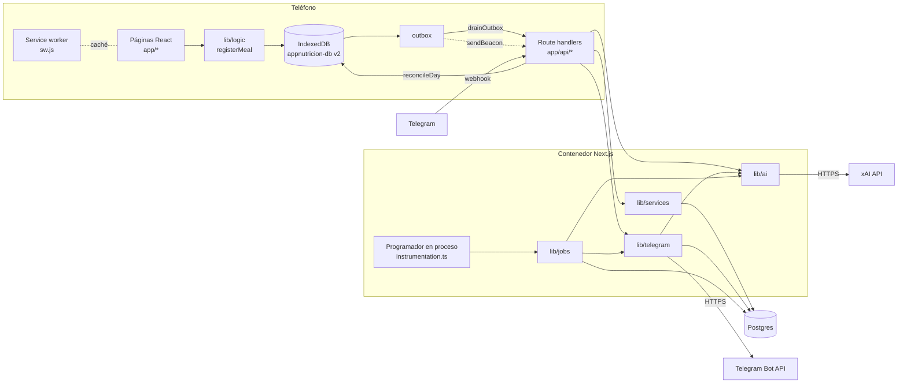
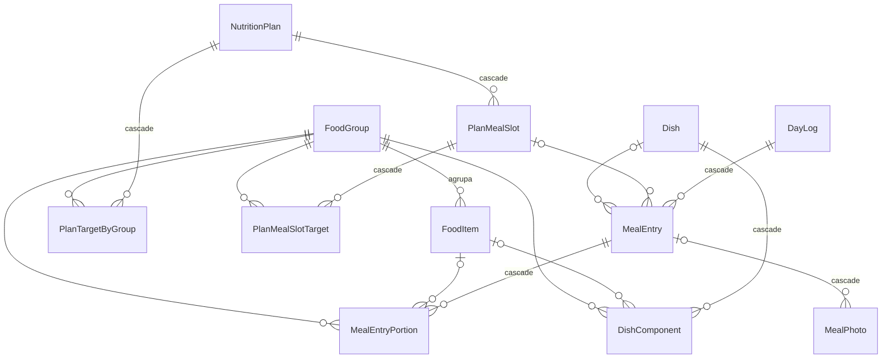
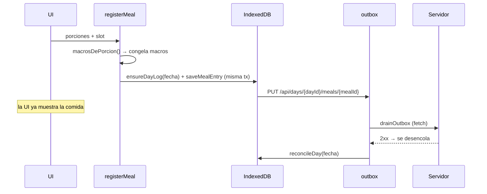
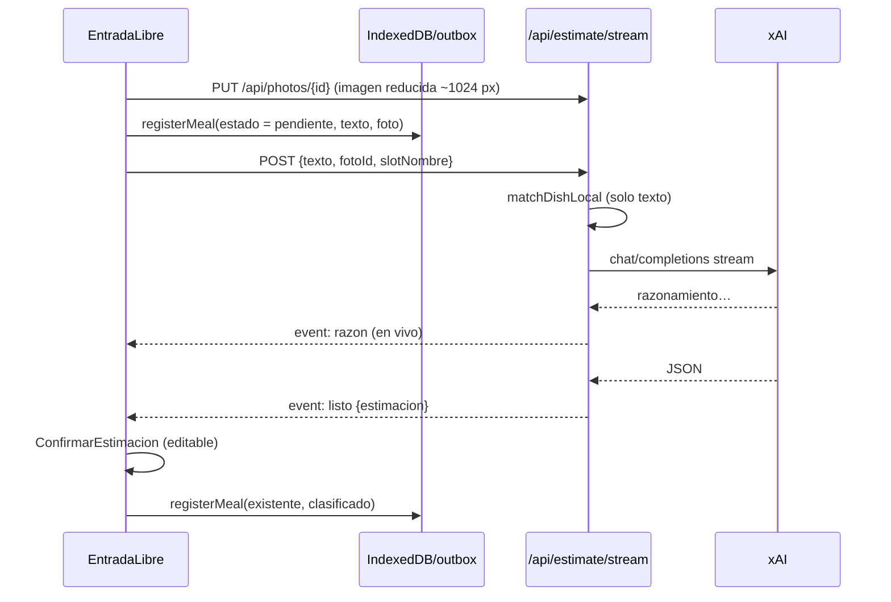

# appnutricion — Especificación técnica y de arquitectura

Documento descriptivo de **cómo está construida la app hoy** (2026-09-26, 27
commits, en vivo en `https://appnutricion.mrhapps.mx`).

Relación con los otros documentos del repo:

| Archivo | Qué es |
|---|---|
| `APP-NUTRICION-SPEC_v3.md` | Contrato de diseño funcional. No se edita. Las referencias `§x.y` de este documento apuntan ahí. |
| `ESTADO.md` | Bitácora viva: fases construidas, desviaciones del spec y su porqué, historia de incidentes. |
| `ARQUITECTURA.md` | Este archivo: el mapa técnico (capas, datos, flujos, despliegue). |

Si este documento y el código discrepan, manda el código.

---

## 1. Resumen

Registro de alimentación de **un solo atleta**, medido en **porciones del SMAE**
(Sistema Mexicano de Alimentos Equivalentes) contra un plan de nutrióloga.
Tiene tres canales de entrada que escriben en la misma base:

1. **PWA offline-first** (Next.js + IndexedDB): registro local instantáneo y
   sincronización en segundo plano.
2. **Bot de Telegram** (`@appnutricion_bot`): texto, foto, nota de voz y comandos.
3. **Estimación por IA** (xAI / `grok-4.5`): convierte texto o foto en
   porciones, siempre con confirmación del atleta.

Principios que moldean toda la arquitectura:

- **Local primero.** Registrar nunca espera a la red; no hay botón de "guardar".
- **Los macros se congelan al registrar** (§7.1). Un log es un hecho histórico.
- **Nunca se pierde un registro**: si la IA falla queda `pendiente`; los borrados
  son lógicos (`archivadoEn`); el outbox nunca se atora por un ítem roto.
- **Sin shell en producción.** Todo lo operativo es idempotente al arranque o
  se expone por HTTP protegido.

---

## 2. Stack

| Capa | Tecnología |
|---|---|
| Framework | Next.js 16.2 (App Router, `output: "standalone"`), React 19.2, TypeScript 5 |
| Estilos / UI | Tailwind 4, Radix (`dialog`, `slot`), `class-variance-authority`, `lucide-react` |
| Validación | Zod 4 |
| ORM / BD | Prisma 6.19 + PostgreSQL (servicio Database de Dokploy) |
| Almacenamiento cliente | IndexedDB vía `idb` 8 |
| Offline | Service worker propio (`public/sw.js`) + manifest PWA |
| IA | xAI API (chat completions compatible OpenAI, `/v1/stt` para voz). Sin SDK: `fetch` directo |
| Mensajería | Telegram Bot API (webhook) |
| Runtime | Node 20 alpine, un solo contenedor en Dokploy / Docker Swarm |

Dependencias deliberadamente ausentes: SDK de IA, `sharp`, librería de
data-fetching, cron. Cada una se evitó por una razón documentada en `ESTADO.md`
(layout de `node_modules` del Dockerfile, sin volumen persistente, sin cron).

---

## 3. Vista general



---

## 4. Estructura del repositorio

Sin `src/`: `app/`, `components/`, `lib/` en la raíz. Alias `@/` → raíz.

```
app/
  hoy/                      Pantalla principal del día
  registrar/[slotClave]/    Flujo de registro a pantalla completa (sin tabs)
  comida/[mealId]/          Editar / borrar una comida
  historial/                Lista de días, gráficas
  historial/[fecha]/        Detalle de un día pasado
  historial/semana/[inicio]/ Revisión semanal
  plan/  ajustes/           Plan vigente; ajustes y estado de sync
  api/                      Route handlers (ver §7)
components/
  hoy/  registrar/  charts/  shell/  shared/  ui/
lib/
  ai/          Proveedor xAI, prompts, estimación, chat, voz, match local
  data/        Datos semilla: catálogo SMAE, platillos, plan
  db/          IndexedDB: esquema, stores, mappers, outbox, reparación
  sync/        Drenado del outbox, flush, beacon, reconciliación
  logic/       Registro de comidas, slot por hora, repetir comida
  nutrition/   Grupos SMAE, macros, adherencia, resumen, revisión semanal
  services/    Lógica de servidor: upserts, seed, fixups de datos
  telegram/    Router de updates, registro, sesiones, mensajes, API
  jobs/        Programador, reclasificación diferida, mensajes salientes
  http/        withRoute (manejo de errores), lector SSE
  validation/  Esquemas Zod de DTOs de red
  media/       Reducción de imágenes en el cliente
  date.ts log.ts prisma.ts athlete.ts
prisma/
  schema.prisma  migrations/  seed.ts
public/
  sw.js  manifest.json  icons/
instrumentation.ts          Arranque del programador en proceso
Dockerfile
```

---

## 5. Base de datos (Postgres / Prisma)

### 5.1 Diagrama entidad-relación



Tablas sin relaciones: `User`, `MealEntryAudit` (sin FK a propósito, sobrevive
al borrado de la comida), `ScheduledJob`, `TelegramUpdate`, `TelegramSession`,
`WeightEntry`, `WeeklyReview`.

### 5.2 Dominios

**Usuario único.** `User` tiene una sola fila sembrada. No hay login ni roles;
`getAthleteId()` la resuelve y la cachea (`lib/athlete.ts`). `exportToken`
existe para la futura API de export (fase 9, pendiente).

**Catálogo (solo lo escribe el seed/fixups).**

| Modelo | Propósito | Notas |
|---|---|---|
| `FoodGroup` | 11 grupos SMAE con su tasa por porción (kcal, P, C, G) y color | `clave` enum único. `libre` tiene tasa 0 |
| `FoodItem` | Alimentos concretos con su equivalencia (`cantidadPorcion`, `cantidadGramos?`) | `alias[]`, `archivadoEn` para ocultar (pescado, salmón) |
| `Dish` | Platillos guardados del plan | `tipoComida[]`, `vecesUsado` ordena por frecuencia |
| `DishComponent` | Porciones de cada grupo que forman un platillo | `foodItemId` nulo + `notaLibre` para genéricos fuera del SMAE |

**Plan.**

| Modelo | Propósito |
|---|---|
| `NutritionPlan` | Objetivos diarios (kcal, macros, fibra, agua), vigencia. **Un solo `activo`**, garantizado por transacción en fixups (no por constraint) |
| `PlanTargetByGroup` | Porciones/día por grupo. Los targets agregados de proteína y grasa se siembran contra un subgrupo representativo |
| `PlanMealSlot` | Tiempos de comida (`desayuno`, `comida`, `snack_pm`, `post_gym`, `cena`…) con hora sugerida |
| `PlanMealSlotTarget` | Porciones por grupo por tiempo |

**Registro (nace en el cliente con UUID v4; sin `@default` en el id).**

| Modelo | Claves | Notas |
|---|---|---|
| `DayLog` | `id` UUID, **`fecha @unique @db.Date`** (clave natural) | peso, agua, notas, ánimo/hambre. `revision` se incrementa en cada escritura propia o de sus comidas — base de la lectura delta |
| `MealEntry` | `id` UUID | `clave` de slot, `horaRegistro`, `dishId?`, `textoLibre`, `titulo`, `version` (guarda de escritura), `origen` (`app`/`telegram`/`import`), `estadoClasificacion` (`clasificado`/`pendiente`/`fallido`), `estimacionIa` JSON, `fotoPrincipalId`, campos de reclamo de reclasificación, `archivadoEn`, `actualizadoEn` |
| `MealEntryPortion` | `id` UUID | grupo, ítem, nombre y cantidad legibles, porciones y **macros congelados** (kcal, P, C, G) |

**Fotos, auditoría, trabajos.**

| Modelo | Notas |
|---|---|
| `MealPhoto` | Imagen en `bytea` (`datos`, `miniatura?`). Se sube **antes** de que exista la comida → `mealEntryId` opcional. ~150-250 KB por fila, tope 400 KB |
| `MealEntryAudit` | Snapshot JSON antes de un borrado o conflicto (§5.4.5) |
| `ScheduledJob` | `clave` = `tipo:fecha` (idempotente), `reclamadoEn` para reclamo atómico, `intentos`, `error` |

**Telegram.**

| Modelo | Notas |
|---|---|
| `TelegramUpdate` | `updateId` BigInt PK = deduplicación. `payloadCrudo` permite re-procesar. `procesadoEn` nulo → lo recoge el barrido |
| `TelegramSession` | Estado conversacional por `chatId` con expiración. La conversación `/chat` usa la clave `${chatId}:chat` para no pisar una estimación pendiente |

**Espejo y análisis.**

| Modelo | Notas |
|---|---|
| `WeightEntry` | Peso por fecha y fuente (`appgym`/`manual`/`telegram`), `@@unique([fecha, fuente])`. Histórico cargado desde CSV en el seed |
| `WeeklyReview` | Declarado; la revisión semanal hoy se calcula al vuelo (`/api/semana`) |

### 5.3 Convenciones de datos

- **`@db.Date` sale a la red como `"YYYY-MM-DD"`**, nunca ISO completo
  (`serializeDayLog`). Esa cadena es la clave del índice `by-fecha` en IndexedDB.
- **Enums de Postgres no se amplían** (`ALTER TYPE` es riesgoso sin shell):
  `snack_am` sigue en el enum sin uso; una nota de voz se registra como `texto`.
- **Sin `@unique` en `Dish.nombre` ni `FoodItem.nombre`** → los fixups
  consultan antes de insertar.
- Índices relevantes: `MealEntry(dayLogId)`, `(dayLogId, clave)`,
  `(estadoClasificacion)`; `ScheduledJob(ejecutarEn, completadoEn)`;
  `TelegramUpdate(procesadoEn)`.

### 5.4 Migraciones y datos iniciales

- Dos migraciones: `20260803174110_init` y `20260804120000_v3_ia_fotos_telegram`.
- Se generan **sin base de datos** con `prisma migrate diff` (receta en
  `ESTADO.md`) y solo se admiten cambios aditivos: `ADD COLUMN` nulable o con
  default, `CREATE TABLE`, `CREATE INDEX`. Una migración fallida deja el
  contenedor sin arrancar.
- `prisma/seed.ts` corre en **cada arranque**:
  1. `seedDatabase` — siembra usuario, grupos, catálogo, platillos, plan y
     pesos del CSV. Se salta completo si ya hay `FoodGroup`.
  2. `applyDataFixups` — corre **siempre**, fuera del early-return. Es el
     **único canal para migrar datos en producción** (p. ej. `ensureBloque2`,
     `ensureBloque3`, `ensurePesosExtra`, relleno de gramos). Idempotente y **no relanza**: un throw tumbaría el
     arranque; el error se escribe en los logs del deploy.

---

## 6. Cliente: offline-first

### 6.1 IndexedDB (`lib/db/indexeddb.ts`)

Base `appnutricion-db`, versión 2.

| Store | Clave | Índices | Contenido |
|---|---|---|---|
| `foodGroups` | `id` | — | Espejo de solo lectura |
| `catalog` | `id` | `by-foodGroupId` | `FoodItem` no archivados |
| `dishes` | `id` | `by-tipoComida` (multiEntry) | Platillos con componentes |
| `plan` | `id` | — | El plan activo (una sola fila) |
| `dayLogs` | `id` | `by-fecha` | Días |
| `mealEntries` | `id` | `by-dayLogId` | Comidas |
| `mealEntryPortions` | `id` | `by-mealEntryId` | Porciones (con `foodGroupClave` denormalizada) |
| `outbox` | `seq` autoincrement | — | Escrituras pendientes |
| `syncState` | externa (`day:YYYY-MM-DD`) | — | Última `revision` fusionada por día |

La migración a v2 ejecuta `repairV2` una sola vez para sanar datos locales
corrompidos por el bug del índice `by-fecha` (ver `ESTADO.md`).

**Regla:** nada entra a IndexedDB desde la red sin pasar por
`lib/db/mappers.ts` (campo por campo, nunca `{...obj}`).

### 6.2 Hidratación

`AppInit` (montado en el layout) al cargar y al volver `online`:

1. `hydrateCatalog()` — `GET /api/catalog`, `/api/dishes`, `/api/plan`; limpia y
   reescribe los stores espejo. Fallo de red silencioso: se sigue con la caché.
2. `reconcileDays([hoy])`.
3. `initSyncListeners()`.

### 6.3 Escritura local y outbox



- `registerMeal` (`lib/logic/registerMeal.ts`) es el camino único para todos los
  modos de registro (platillo, repetir, IA, ajuste manual). Acepta `existente`
  para completar una comida ya reservada como `pendiente` (sube `version`, no
  toca `horaRegistro`).
- Cada escritura encola un `OutboxRecord` con `eventId`, método, URL y body.

**Drenado (`lib/sync/drain.ts`):**

- Recorre en orden `seq`, pero **no se detiene ante un fallo**: cada PUT de
  comida crea su día padre por `fecha`, así que el orden ya no importa.
- 2xx → desencola. 5xx / 408 / 425 / 429 / error de red → backoff exponencial
  con jitter (30 s × 2ⁿ, tope 5 min). Otro 4xx → `permanentError`, visible en
  `SyncErrorSheet` con botones Reintentar / Descartar.
- Tras un despliegue nuevo (`NEXT_PUBLIC_BUILD_ID` distinto) los errores
  permanentes se reintentan una vez.
- "Descartar" borra la fila del outbox **y** la comida local.

**Disparadores (`lib/sync/flush.ts`):** inicio, `visibilitychange`, `pagehide`,
`online`, `beforeunload` y un poll cada 15 s con la pestaña visible. En
`pagehide`/oculto se manda además `navigator.sendBeacon` a `/api/sync/beacon`
con lo pendiente (respaldo best-effort, no desencola).

### 6.4 Reconciliación multi-escritor (`lib/sync/reconcile.ts`, §5.4)

El servidor es autoritativo sobre el **conjunto** de comidas de un día.

1. `GET /api/days/{fecha}?desde_revision=N`. Si no hay cambios responde
   `sinCambios` (la `revision` es detector, no cursor). Frescura de 5 s.
2. Si el id local del día difiere del canónico del servidor, se repuntan las
   comidas locales al id canónico.
3. Fusión por UUID:
   - archivada en servidor → se borra local (salvo escritura pendiente);
   - conflicto → gana el `actualizadoEn` más reciente (§5.4.5);
   - si no, se reemplaza la comida y sus porciones.
4. Se podan "fantasmas": comidas locales del día que el servidor no menciona y
   que no tienen escritura pendiente en el outbox.

### 6.5 Service worker (`public/sw.js`)

| Petición | Estrategia | Caché |
|---|---|---|
| `/_next/static/*` | cache-first (inmutables por hash) | `static-v2` |
| `/api/catalog`, `/api/dishes`, `/api/plan` | stale-while-revalidate | `data-v2` |
| Navegaciones | network-first con respaldo a caché | `shell-v2` (precarga `/hoy`, `/historial`, `/plan`, `/ajustes`) |
| Cualquier no-GET | no se intercepta | — |

Al cambiar el shell hay que subir `CACHE_VERSION`.

### 6.6 Pantallas y navegación

Pestañas: **Hoy / Historial / Plan / Ajustes** (`components/shell/TabBar.tsx`).
`/registrar/*` y `/comida/*` son tareas a pantalla completa, sin pestañas.

- **Hoy** (`useHoyData`): renglones por tiempo de comida con kcal y proteína
  (estilo caltrack), barras de porciones de las 5 categorías visibles, macros,
  agua, peso, nota del día. Las comidas de un slot que el plan ya no tiene se
  muestran aparte.
- **Registrar**: platillos guardados del slot, repetir (ayer / última vez),
  entrada libre (texto + foto de cámara o galería → IA), y "ajustar porciones a
  mano" como enlace secundario.
- **Historial**: agregados por rango (`/api/historial`), detalle por día,
  revisión semanal.

---

## 7. API HTTP

Todas las rutas que mutan van envueltas en `withRoute` (`lib/http/route.ts`),
que traduce errores a códigos honestos — el cliente decide reintentar o no por
el status:

| Error | Respuesta |
|---|---|
| `ZodError` | 422 `validacion` |
| Prisma P2002 (único) | 409 `conflicto_unico` |
| Prisma P2003 (FK) | 422 `referencia_invalida` |
| Prisma P2025 | 404 `no_encontrado` |
| Otro | 500 `interno` + `errorId` (cruzable con el log) |

Cuerpo de error: `{ error: true, codigo, detalle?, errorId? }`.

**Regla de DTOs:** campos opcionales con `.nullish()`, nunca `.nullable()`
(`JSON.stringify` borra claves `undefined`); ningún `as` entre construir y
enviar un payload.

### 7.1 Endpoints

| Método y ruta | Auth | Qué hace |
|---|---|---|
| `GET /api/catalog` | — | Grupos + ítems no archivados |
| `GET /api/dishes` | — | Platillos no archivados, por `vecesUsado` desc |
| `GET /api/plan` | — | Plan activo con targets y slots |
| `GET /api/days/{id\|fecha}?desde_revision=` | — | Lectura delta del día, **incluye archivadas** |
| `PUT /api/days/{id}` | — | Upsert del día **por `fecha`**; devuelve `idCanonico` |
| `PUT /api/days/{id}/meals/{mealId}` | — | Upsert idempotente de comida + reemplazo de porciones |
| `DELETE /api/days/{id}/meals/{mealId}` | — | Borrado lógico + snapshot en `MealEntryAudit` |
| `POST /api/sync/beacon` | — | Lote de PUTs pendientes desde `sendBeacon` |
| `PUT /api/photos/{id}` | — | Foto binaria (jpeg/png/webp, ≤ 400 KB) |
| `GET /api/photos/{id}[?mini=1]` | — | Imagen, `Cache-Control: immutable` |
| `POST /api/estimate` | — | Propone estimación; **no escribe**. 503 `ia_no_disponible` con `motivo` |
| `POST /api/estimate/stream` | — | Igual, como SSE: eventos `fase`, `razon`, `listo`, `sin_ia`, `falla` |
| `GET /api/historial?desde=&hasta=` | — | Agregados diarios desde porciones congeladas + adherencia + peso |
| `GET /api/semana/{inicio}` | — | Revisión semanal (con semana previa para delta de peso) |
| `POST /api/telegram/webhook` | header secreto de Telegram | Entrada del bot |
| `GET\|POST /api/telegram/setup` | `x-jobs-secret` | Consultar / registrar el webhook |
| `POST /api/jobs/tick` | `x-jobs-secret` | Corre un tick del programador y devuelve el reporte |
| `GET /api/ai/health[?probe=1]` | `x-jobs-secret` para `probe` | Config de IA; `probe` hace una llamada real |

"Nada se crea con POST": los recursos de registro nacen con UUID en el cliente
y se escriben con `PUT` idempotente. Los POST existentes son acciones, no
creaciones.

### 7.2 Semántica de escritura en servidor

- **`upsertDayLog`** resuelve por `fecha`: el primer UUID que llega queda como
  canónico; los demás se pliegan (maneja la carrera P2002 releyendo).
- **`upsertMealEntry`**:
  - guarda de versión: si la guardada es mayor, devuelve la existente sin tocar;
  - en una transacción: resuelve/crea el `DayLog` por `fecha`, upsert de la
    comida, reemplaza porciones, `revision++` del día, y `vecesUsado++` del
    platillo solo al crear.
- **`archiveMealEntry`**: idempotente; snapshot → `archivadoEn` → `version++` →
  `revision++`.

---

## 8. Dominio nutricional (`lib/nutrition/`)

- **Tasas SMAE** en `FOOD_GROUPS` (`groups.ts`), también sembradas en `FoodGroup`.
- **Congelado de macros:** `macrosDePorcion(grupo, porciones, propias?)` es el
  único punto de cálculo. Tasa del grupo × porciones, **excepto `libre`**, que
  acepta macros por porción propias (alcohol, refrescos, productos de marca).
  `macrosPropiasGuardadas` recupera esa tasa al editar dividiendo lo guardado.
- **Barras visibles** (`DISPLAY_GROUPS`): Proteína (3 subgrupos AOA), Cereales,
  Grasas (2 subgrupos), Frutas, Verduras. `libre` y leguminosa no tienen barra.
- **Adherencia** (`adherence.ts`, §7.2), calculada al vuelo, agregada por barra:

  ```
  adherencia = 100 − Σ|real − objetivo| / Σ objetivo × 100   (verduras excluidas)
  ```

  Un día siguiendo el plan lee ~79-91 %; el objetivo de diseño es 85-90 %.
- **Revisión semanal** (`weeklyReview.ts`, §3.5/§7.3): una sola desviación
  dominante; con menos de 4 días registrados no sugiere; peso en promedio móvil
  de 7 días. La app sugiere, nunca cambia el objetivo sola.

---

## 9. IA (`lib/ai/`)

| Archivo | Rol |
|---|---|
| `provider.ts` | Cliente xAI (`xaiChat`): JSON o prosa, streaming opcional (`reasoning_content` + `content`), timeout de **inactividad** 60 s que se rearma con cada trozo. `aiConfig()` falla cerrado sin `XAI_MODEL`. `AiUnavailableError` con causa (`sin_llave`, `red`, `http`, `parseo`, `timeout`, `truncado`) y `MOTIVO_LEGIBLE` |
| `estimatePortions.ts` | Orquestador compartido por app, Telegram y reclasificación |
| `localMatch.ts` | Atajo local: alias de platillo guardado, solo con texto y sin palabras de comida sobrantes. ~3 ms, confianza 1 |
| `prompt.ts` / `schema.ts` | Prompt de estimación (incluye tabla SMAE; razonar en español al frente). `parseEstimacion` valida con Zod, rellena `items`↔`porciones` en ambos sentidos, descarta macros fuera de `libre` |
| `dishContext.ts` | Los platillos más usados como contexto |
| `chat.ts` / `promptChat.ts` | Respuestas de `/chat`: contexto con plan y targets por tiempo, el día de hoy, recetas con cantidades y tabla SMAE |
| `transcribe.ts` | Voz → texto con `POST /v1/stt` (`format=true`, OGG/Opus nativo) |

### 9.1 Flujo de estimación en la app



- El registro se **reserva como `pendiente` antes** de llamar al modelo; si la
  pestaña muere, la comida existe igual. "Cancelar" la archiva.
- Si la IA no está disponible (`sin_ia` / 503), la comida queda `pendiente` con
  el motivo en `notas`.
- La IA **nunca escribe**: propone; el atleta confirma (§3.2).

### 9.2 Reclasificación diferida (`lib/jobs/reclassify.ts`)

En cada tick, hasta 3 comidas `pendiente` se reclaman atómicamente
(`reclasificacionReclamadaEn`, caduca a los 10 min), se re-estiman y se
completan. Tras 5 intentos pasan a `fallido`: visibles y editables, nunca
borradas.

---

## 10. Telegram (`lib/telegram/`)

### 10.1 Webhook (`app/api/telegram/webhook/route.ts`)

Orden fijo de comprobaciones:

1. Header `X-Telegram-Bot-Api-Secret-Token` → si no coincide, 401 sin cuerpo.
2. `chat_id` ≠ `TELEGRAM_CHAT_ID` → 200 y silencio.
3. Deduplicación: `createMany(skipDuplicates)` en `TelegramUpdate` por `update_id`.
4. `procesarUpdate()` **sin await** (el proceso `node server.js` es persistente).
5. 200 inmediato → Telegram nunca reintenta por latencia de la IA.

Red de seguridad: el barrido del programador re-procesa updates con
`procesadoEn` nulo de más de 2 min (hasta 3 intentos).

### 10.2 Router (`router.ts`)

| Entrada | Comportamiento |
|---|---|
| `/desayuno` `/comida` `/cena` `/snack` `/postgym` + texto/foto | Estima para ese slot |
| Texto o foto sin comando | La hora decide el slot (`currentSlotForTime`) |
| Texto con forma de pregunta (`?`, `¿`, qué/cuánto/cómo…) | Se contesta con `/chat`, no se registra |
| Foto con pie interrogativo | Se contesta mirando la imagen, ofrece registrar |
| `/chat`, `/olvida` | Conversación con memoria (8 turnos; fotos persistidas como `[foto]`) |
| `/agua N`, `/peso N` | Suma agua / registra peso |
| `/hoy` `/ayer` `/semana` `/platillos` `/deshacer` `/ayuda` | Consultas y deshacer |
| Nota de voz / audio / video_note | Transcribe y repite lo entendido; `normalizarComandoHablado` reconstruye comandos solo con separador explícito |

Registro (`registro.ts`): `proponerRegistro` guarda la estimación en
`TelegramSession` y manda una tarjeta con botones inline (confirmar, ajustar por
grupo, cancelar). `confirmarRegistro` construye porciones del lado del servidor
con `macrosDePorcion` y escribe `MealEntry` con `origen = telegram`. Si la IA
falla se guarda `pendiente` igual (`guardarPendiente`).

### 10.3 Mensajes salientes (`lib/jobs/telegramSalientes.ts`)

- Resumen diario a las **21:30** locales.
- Revisión semanal los **domingos 09:00**.

---

## 11. Programador en proceso (`lib/jobs/scheduler.ts`)

No hay cron en el contenedor. `instrumentation.ts` llama `startScheduler()` en
el runtime Node: primer tick a los 10 s, luego cada 60 s
(`SCHEDULER_ENABLED=0` lo apaga).

Cada `tick()`:

1. **Encola** los trabajos del día en `ScheduledJob` con clave `tipo:fecha`
   (`createMany skipDuplicates` → idempotente). Horas locales convertidas a UTC
   con `Intl` (America/Matamoros tiene horario de verano).
2. **Reclama y ejecuta** hasta 5 vencidos: `updateMany where reclamadoEn = null`
   como reclamo atómico; en fallo libera el reclamo e incrementa `intentos`
   (máx. 3).
3. **Barre** updates de Telegram sin procesar.
4. **Reclasifica** hasta 3 comidas `pendiente`.

`POST /api/jobs/tick` corre lo mismo de forma síncrona (verificación externa o
respaldo con un cron externo).

---

## 12. Fotos (`lib/media/downscale.ts`)

- Reducción en el cliente con `createImageBitmap` + canvas a ~1024 px (JPEG) y
  miniatura de 128 px. Sin dependencias.
- Se guardan en Postgres (`MealPhoto.datos` `bytea`) porque la app no tiene
  volumen persistente.
- La foto se sube **antes** de estimar, con UUID de cliente; la comida la
  referencia por `fotoPrincipalId`.
- Telegram descarga la foto por `file_id` y la guarda con `origen = telegram`.

---

## 13. Tiempo y fechas

- Zona de la app: **`America/Matamoros`** (`lib/date.ts`), no la de appgym.
- `localDayString()` para "hoy"; nunca `toISOString().slice(0, 10)` sobre un
  instante (desplaza el día cerca de medianoche).
- Columnas `@db.Date` se construyen como `new Date("YYYY-MM-DDT00:00:00.000Z")`
  y se serializan como `YYYY-MM-DD`. `dateOnlyToLocalDate` para mostrarlas sin
  depender del huso del visor.

---

## 14. Despliegue y operación

### 14.1 Infraestructura

- VPS con Dokploy (Docker Swarm). Project `appnutricion` con:
  - Application `appnutricion` (build por Dockerfile desde GitHub, rama `main`);
  - Database Postgres, alcanzable por su `appName` en la red interna.
- Dominio `appnutricion.mrhapps.mx`, HTTPS con Let's Encrypt, puerto 3000.

### 14.2 Imagen (`Dockerfile`)

Tres etapas (`deps` → `builder` → `runner`, node:20-alpine). El runner copia el
`standalone` de Next **más** `node_modules` completo, `prisma/`, `lib/` y
`tsconfig.json` para poder correr el seed con `tsx`. Arranque:

```sh
prisma migrate deploy && tsx prisma/seed.ts && node server.js
```

Cualquier fallo en los dos primeros pasos impide que la app levante — de ahí
las reglas de migraciones aditivas y fixups que no relanzan.

### 14.3 Variables de entorno

| Variable | Uso |
|---|---|
| `DATABASE_URL` | Postgres |
| `NODE_ENV` | `production` |
| `XAI_API_KEY`, `XAI_MODEL`, `XAI_VISION_MODEL`, `XAI_BASE_URL` | IA (hoy `grok-4.5` para ambos modelos). Sin llave/modelo la app funciona y todo queda `pendiente` |
| `TELEGRAM_BOT_TOKEN`, `TELEGRAM_CHAT_ID`, `TELEGRAM_WEBHOOK_SECRET` | Bot |
| `JOBS_SECRET` | Protege `jobs/tick`, `telegram/setup`, `ai/health?probe=1` |
| `APP_BASE_URL` | URL pública para registrar el webhook |
| `SCHEDULER_ENABLED` | `0` apaga el reloj en proceso |
| `WEIGHT_CSV_PATH` | Solo seed local: CSV histórico de peso (no se commitea) |
| `WEIGHT_CSV_BASE64`, `PESOS_EXTRA_BASE64` | Datos de peso reales (el repo es público): histórico en CSV y pesos sueltos en JSON, cargados al arranque |

`application.saveEnvironment` de Dokploy **reemplaza** el bloque entero: leerlo
completo con `application.one` antes de reenviarlo.

### 14.4 Observabilidad

- Sin `docker exec`, sin shell y sin puerto de Postgres publicado: **los logs de
  stdout son la única ventana**. `logEvent()` escribe una línea JSON por evento
  (`route_ok`, `route_error` con `errorId`, `tg_update`, `job_ok`,
  `estimate_stream_ok`, `ia_match_local`…).
- Verificación desde fuera: `curl` a la URL en vivo, `GET /api/ai/health`,
  `POST /api/jobs/tick`, `GET /api/telegram/setup`.
- En el cliente: `SyncStatusIndicator` y `SyncErrorSheet` exponen el outbox.

### 14.5 Verificación antes de desplegar

```sh
npx tsc --noEmit && npx eslint && npm run build && npx prisma validate
```

Deploy: `git push` a `main` + `application.deploy` en la API de Dokploy; luego
`curl -I https://appnutricion.mrhapps.mx`.

---

## 15. Seguridad

- App de un solo usuario **sin autenticación** en la PWA: la protección es la
  oscuridad del dominio. Las rutas de lectura y escritura del registro son
  públicas.
- Superficies protegidas: webhook (secreto de Telegram + chat único) y rutas
  operativas (`x-jobs-secret`).
- Las credenciales viven solo en el entorno de Dokploy; `.env` local no se
  commitea.

---

## 16. Pendiente (según `ESTADO.md`)

| Fase | Qué |
|---|---|
| 8 | Sincronización con `appgym` (peso / entrenamiento) — `WeightEntry.fuente = appgym` ya existe |
| 9 | API de export `/api/v1/export/*` con `User.exportToken` + markdown |
| — | Editor de platillos (hoy el catálogo solo cambia vía `applyDataFixups`) |
| — | Persistir `DayLog.adherenciaPct` y `WeeklyReview` (hoy se calculan al vuelo) |
